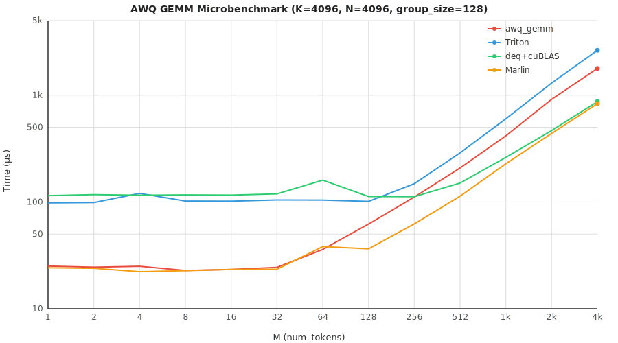

<!-- <p align="center">

</p>

<p align="center">
<a href="https://trendshift.io/repositories/15323" target="_blank"></a>
</p> -->

# GrYe-Nano-vLLM

基于Nano-vLLM的个人优化项目

## Key Features

* 🚀 **KV Cache INT8 量化** - 基于Per Token Head粒度的INT8量化。通过lm-eval测试数据集gsm8k，准确率相较fp16无明显劣化；性能方面，Qwen3-8B模型上吞吐提升51.5%
* 📖 **AWQ量化** - 支持加载AWQ量化模型。通过lm-eval测试数据集gsm8k，准确率相较hf无明显劣化；性能方面，Qwen3-8B模型上吞吐提升120%
* 📖 **接入lm-eval** - 实现适配器，可通过lm-eval评估准确率

## Installation

```bash
uv pip install -e . --no-build-isolation
```

## Model Download

通过huggingface下载模型，并重定向~/huggingface/
```bash
hf download Qwen/Qwen3-8B --local-dir ~/huggingface/Qwen3-8B
```

## 实验数据

**实验环境**
- Hardware: RTX 4090 (24GB)
- Model: Qwen3-8B
- Total Requests: 256 sequences
- Input Length: Randomly sampled between 100–1024 tokens
- Output Length: Randomly sampled between 100–1024 tokens

### KV Cache INT8量化:

开启KV Cache INT8量化，修改LLM调用处config
```bash
llm = LLM(path, enforce_eager=False, max_model_len=4096, kv_cache_dtype="int8_per_token_head")
```
**性能**

```bash
python bench.py
```

- baseline
```
Total: 133966 tok, Time: 156.43s, Throughput: 856.37 tok/s
TTFT:  62612.1 ms (avg)
TPOT:  28.53 ms (avg)
```

- INT8量化
```
Total: 133966 tok, Time: 103.25s, Throughput: 1297.45 tok/s
TTFT:  33724.1 ms (avg)
TPOT:  35.49 ms (avg)
```

**准确率**

- baseline 
```bash
model = NanoVLLM(os.path.expanduser("~/huggingface/Qwen3-8B/"))
python eval_gsm8k.py
```
|Tasks|Version|     Filter     |n-shot|  Metric   |   |Value |   |Stderr|
|-----|------:|----------------|-----:|-----------|---|-----:|---|-----:|
|gsm8k|      3|flexible-extract|     5|exact_match|↑  |0.8832|±  |0.0088|
|     |       |strict-match    |     5|exact_match|↑  |0.8787|±  |0.0090|

- INT8量化
```bash
model = NanoVLLM(os.path.expanduser("~/huggingface/Qwen3-8B/"), kvcache_dtype="int8_per_token_head")
python eval_gsm8k.py
```
|Tasks|Version|     Filter     |n-shot|  Metric   |   |Value |   |Stderr|
|-----|------:|----------------|-----:|-----------|---|-----:|---|-----:|
|gsm8k|      3|flexible-extract|     5|exact_match|↑  |0.8749|±  |0.0091|
|     |       |strict-match    |     5|exact_match|↑  |0.8704|±  |0.0093|


### AWQ量化:

下载并加载对应AWQ模型
```bash
path = os.path.expanduser("~/huggingface/Qwen3-8B-AWQ/")
```
**性能**
- baseline
```
Total: 133966 tok, Time: 155.27s, Throughput: 862.78 tok/s
TTFT:  62132.2 ms (avg)
TPOT:  28.32 ms (avg)
```

- AWQ(Marlin)
```
Total: 133966 tok, Time: 70.63s, Throughput: 1896.69 tok/s
TTFT:  24498.8 ms (avg)
TPOT:  33.56 ms (avg)
```

- AWQ (dispatch: awq_gemm ; dequant+cuBLAS)

原始AWQ cuda kernel实现，需要config手动关闭`awq_use_marlin`（默认使用Marlin）

```bash
llm = LLM(path, enforce_eager=False, max_model_len=4096, awq_use_marlin=False)
```
dispatch策略根据MicroBench数据决定，M<=512时awq_gemm更优，M>512时dequant+cuBLAS更优

```
Total: 133966 tok, Time: 82.71s, Throughput: 1619.73 tok/s
TTFT:  23889.6 ms (avg)
TPOT:  54.37 ms (avg)
```

- MicroBench
```bash
python profile/microbench_awq.py
```
K=4096, N=4096, group_size=128
<p align="center">

</p>

<div align="center">

|  M   | awq_gemm | Triton | deq+cuBLAS | Marlin | best |
|:----:|:--------:|:------:|:----------:|:------:|:----:|
|  1   |   25.1   |  98.0  |   114.6    |  24.2  | Marlin |
|  2   |   24.5   |  98.7  |   117.1    |  23.9  | Marlin |
|  4   |   25.0   | 120.3  |   115.6    |  22.2  | Marlin |
|  8   |   22.8   | 101.9  |   116.4    |  22.7  | Marlin |
|  16  |   23.3   | 101.6  |   116.0    |  23.3  | Marlin |
|  32  |   24.4   | 104.3  |   119.0    |  23.4  | Marlin |
|  64  |   35.9   | 104.1  |   160.0    |  38.2  | awq_gemm  |
| 128  |   62.1   | 101.1  |   112.3    |  36.4  | Marlin |
| 256  |  111.0   | 148.1  |   112.0    |  62.3  | Marlin |
| 512  |  207.9   | 287.9  |   150.5    | 113.2  | Marlin |
| 1024 |  416.2   | 602.1  |   261.7    | 227.8  | Marlin |
| 2048 |  914.8   | 1299.6 |   466.5    | 438.5  | Marlin |
| 4096 | 1779.3   | 2636.5 |   870.5    | 832.8  | Marlin |

</div>


## Note
原始Nano-vLLM项目使用Qwen3-0.6B的小模型进行测试，而在该项目的量化改动中，小模型存在以下问题，因此使用Qwen3-8B

1、KV cache量化中，小模型的准确率急剧下降（45%->5%）

2、AWQ量化中，AWQ模型的吞吐相比于bf16模型吞吐劣化约14%

关于1，小模型因为模型参数少，对量化参数更敏感，【贴上相关资料】

关于2，awq量化没有节省计算，都是fp16的tensor core，因此对于throughput来说就是节约访存，但是因为需要反量化，因此只有两种选择：1、单独的反量化kernel 2、反量化+GEMM融合算子，这两种方式都会带来额外的性能损耗，反量化本身也有额外的指令开销。然而小模型的参数量小，导致量化带来的访存优化反而不如性能损耗，因此小模型上反而劣化。
【贴上相关资料】