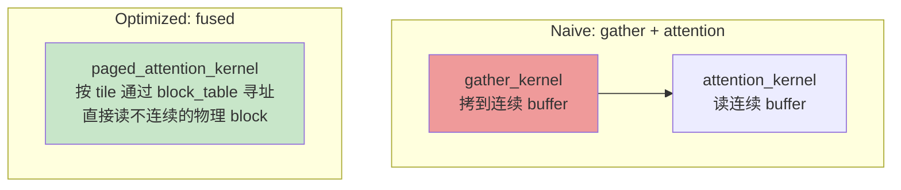
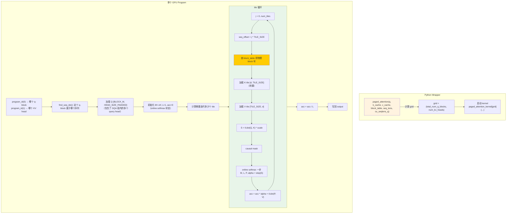
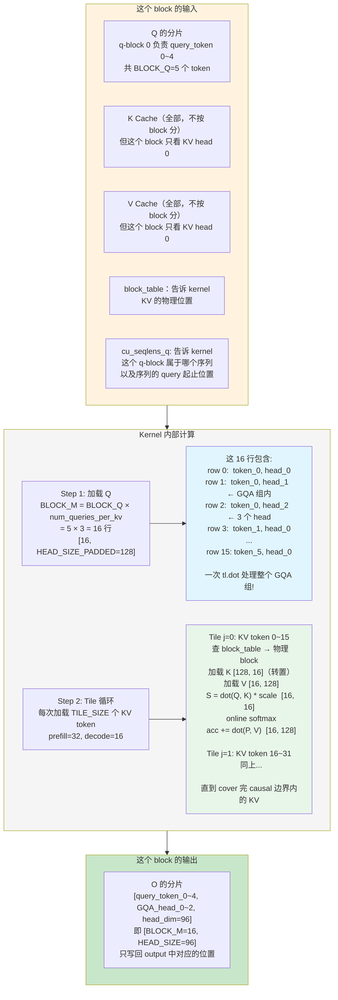
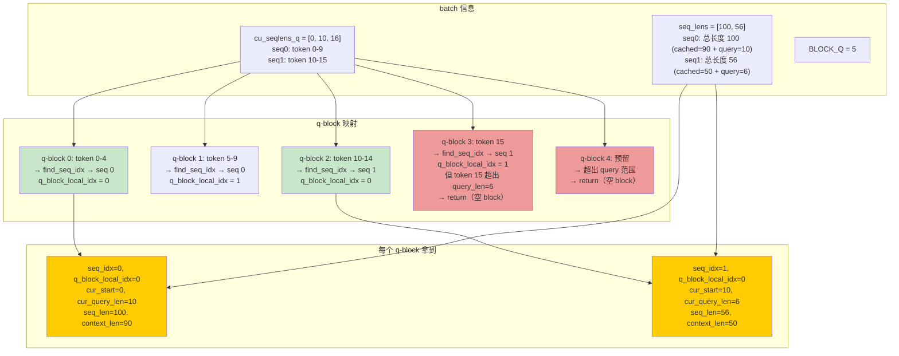
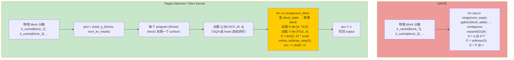

# Paged Attention Kernel 学习笔记

## 目录

- [1. 核心问题：KV Cache 不连续](#1-核心问题kv-cache-不连续)
- [2. Naive 实现：先 gather 再做 attention](#2-naive-实现先-gather-再做-attention)
- [3. 优化实现：融合 gather 的 tiled attention](#3-优化实现融合-gather-的-tiled-attention)
- [3.1 数据分块全景](#31-数据分块全景)
- [3.2 Cache 存储布局与 Stride 寻址](#32-cache-存储布局与-stride-寻址)
- [4. 优化一：Fused Gather — 按 tile 动态寻址](#4-优化一fused-gather--按-tile-动态寻址)
- [5. 优化二：Online Softmax — 去掉完整 S 矩阵](#5-优化二online-softmax--去掉完整-s-矩阵)
- [6. 优化三：Causal Bound Tile 裁剪](#6-优化三causal-bound-tile-裁剪)
- [7. 优化四：GQA Group Contiguity](#7-优化四gqa-group-contiguity)
- [8. 优化五：tl.constexpr 死代码消除](#8-优化五tlconstexpr-死代码消除)
- [9. 总结](#9-总结)

---

## 1. 核心问题：KV Cache 不连续

### 1.1 Paged Attention 的由来

LLM 推理时，KV Cache 是**按 block 分配的**（每个 block 16 个 token）。一个序列的 KV block 在物理上**不连续**：

```
序列 A: 逻辑 block 0 → 物理 block #7
        逻辑 block 1 → 物理 block #3
        逻辑 block 2 → 物理 block #15

序列 B: 逻辑 block 0 → 物理 block #1
        逻辑 block 1 → 物理 block #9
```

物理 block 的分配是动态的（谁需要就分配给谁），所以同一个序列的 block 散落在显存各处。

### 1.2 Block Table

每个序列维护一张映射表：

```
block_table[seq_A] = [7, 3, 15]     # 逻辑 block i → 物理 block block_table[seq][i]
block_table[seq_B] = [1, 9]
```

要访问序列 A 第 20 个 token 的 K/V：
```
逻辑 block = 20 // 16 = 1
物理 block = block_table[seq_A][1] = 3
block 内偏移 = 20 % 16 = 4
K[20] = k_cache[3][4]                # 物理 block 3, slot 4
```

### 1.3 Paged Attention 要做什么

给定：
- `Q` — 当前 batch 所有 query token（可能在多个序列中）
- `k_cache`, `v_cache` — 所有物理 block 中的 K/V（不连续！）
- `block_table` — 每个序列的逻辑 → 物理映射
- `seq_lens` — 每个序列的总长度（之前缓存的 + 当前 query 的）
- `cu_seqlens_q` — 每个序列的 query token 数（cumulative sum）

计算：
```
O[i] = softmax(Q[i] @ K[:seq_len[i]]^T / sqrt(d)) @ V[:seq_len[i]]
```

关键难点：**K[:seq_len[i]] 不连续，需要通过 block_table 间接寻址才能读到**。

---

## 2. Naive 实现：先 gather 再做 attention

最直接的想法：**先把不连续的 K/V 从各个物理 block 拷到一个连续 buffer 里，然后在这个连续 buffer 上做标准 attention。**

```python
import torch
import torch.nn.functional as F

def naive_paged_attention(
    q,                      # [total_tokens, num_query_heads, head_dim]
    k_cache,                # [num_blocks, block_size, num_kv_heads, head_dim]
    v_cache,                # 同上
    block_table,            # [num_seqs, max_num_blocks] int32
    seq_lens,               # [num_seqs] — 每个序列的总长度
    cu_seqlens_q,           # [num_seqs + 1] — query token 累积和
    scale,                  # softmax_scale = 1/sqrt(head_dim)
):
    num_seqs = len(seq_lens)
    num_kv_heads = k_cache.shape[2]
    num_query_heads = q.shape[1]
    num_queries_per_kv = num_query_heads // num_kv_heads
    block_size = k_cache.shape[1]
    head_dim = k_cache.shape[3]
    outputs = []

    for seq_idx in range(num_seqs):
        # ──────────────────────────────────────────────────────────
        # Step 1: GATHER — 把 KV 从分散的 block 收集成连续 buffer
        # ──────────────────────────────────────────────────────────
        ctx_len = seq_lens[seq_idx]                     # 该序列的总 KV 长度
        num_blocks = (ctx_len + block_size - 1) // block_size  # 占了多少个 block

        # 分配连续 buffer
        k_contiguous = torch.zeros(ctx_len, num_kv_heads, head_dim, device=q.device, dtype=k_cache.dtype)
        v_contiguous = torch.zeros(ctx_len, num_kv_heads, head_dim, device=q.device, dtype=v_cache.dtype)

        for logical_block in range(num_blocks):
            phys_block = block_table[seq_idx, logical_block].item()  # block_table 查物理地址
            start = logical_block * block_size
            end = min(start + block_size, ctx_len)
            n = end - start  # 最后一个 block 可能不满

            # 从物理 block 拷到连续 buffer
            k_contiguous[start:end] = k_cache[phys_block, :n]
            v_contiguous[start:end] = v_cache[phys_block, :n]

        # ──────────────────────────────────────────────────────────
        # Step 2: 取该序列的 Q
        # ──────────────────────────────────────────────────────────
        q_start = cu_seqlens_q[seq_idx]
        q_end = cu_seqlens_q[seq_idx + 1]
        q_seq = q[q_start:q_end]  # [num_query_tokens, num_query_heads, head_dim]

        # ──────────────────────────────────────────────────────────
        # Step 3: GQA — 把 KV head expand 到 query head 数量
        # ──────────────────────────────────────────────────────────
        # num_query_heads=12, num_kv_heads=4 → 每个 KV head 对应 3 个 query head
        k_expanded = k_contiguous.repeat_interleave(num_queries_per_kv, dim=1)
        v_expanded = v_contiguous.repeat_interleave(num_queries_per_kv, dim=1)

        # ──────────────────────────────────────────────────────────
        # Step 4: 标准 attention
        # ──────────────────────────────────────────────────────────
        # S = Q @ K^T * scale     [num_q, num_q_head, head_dim] @ [ctx, num_q_head, head_dim]^T
        S = torch.einsum("qhd,khd->qhk", q_seq, k_expanded) * scale

        # Causal mask: token i 只能 attend 到 token ≤ i
        # context_len = 之前缓存的 token 数
        # query_pos = 当前 query token 在该序列中的绝对位置
        context_len = ctx_len - (q_end - q_start)
        for qi in range(q_end - q_start):
            query_abs_pos = context_len + qi
            S[qi, :, query_abs_pos+1:] = float("-inf")  # mask 掉未来 token

        # Softmax
        P = torch.softmax(S, dim=-1)  # [num_q, num_q_head, ctx_len]

        # 加权求和
        O = torch.einsum("qhk,khd->qhd", P, v_expanded)  # [num_q, num_q_head, head_dim]
        outputs.append(O)

    return torch.cat(outputs, dim=0)
```

### Naive 实现的问题

```
                    显存写               显存读
物理 block 0 ──────→ k_contiguous[0..15] ──────→ attention
物理 block 7 ──────→ k_contiguous[16..31]──────→ attention
物理 block 3 ──────→ k_contiguous[32..47]──────→ attention
                     ↑                      ↑
                  浪费带宽             还得再读一次
```

| 问题 | 具体代价 |
|------|---------|
| **1 次额外的显存写** | gather 把 KV 从一个地方拷到另一个地方 |
| **1 次额外的显存读** | attention 再读一遍 gather 好的 buffer |
| **KV 全量读入** | 不管 causal mask 挡住多少，全部 gather 进来 |
| **逐序列串行** | for 循环一个个序列做，GPU 利用率低 |
| **多次 kernel launch** | gather kernel × N + attention kernel × N |

**核心瓶颈**：gather 操作引入了额外的显存带宽消耗，而 attention 是带宽敏感型计算。

---

## 3. 优化实现：融合 gather 的 tiled attention

### 核心思路

**不在 attention 之前做 gather，而是在 attention 内部按 tile 加载 K/V 时，通过 block_table 实时寻址。**



### 优化后的整体流程



### 对比：Naive vs Optimized

| 步骤 | Naive | Optimized |
|------|-------|-----------|
| gather | 先拷到连续 buffer（O(N)显存写） | 不拷，tile 循环中实时寻址 |
| 加载 KV | 一次性加载全部 | 按 tile 每次只加载 TILE_SIZE 个 |
| softmax | 完整 S 矩阵（O(N²)显存） | online softmax（O(1)显存） |
| GQA | expand 后做 attention | 矩阵排布一次 `tl.dot` 算完 |
| launch | 多个 kernel | 一个 kernel 完成全部 |

---

## 3.1 数据分块全景

这是理解 kernel 最关键的一张图：**输入 tensor 的 shape 如何映射到 GPU grid，每个 block 处理什么数据。**

### 3.1.1 所有输入 tensor 的 shape 和各字段含义

#### 先讲清楚两个关键概念

```
context_len = 该序列之前已经缓存的 token 数（在 KV Cache 中）
query_len   = 当前 forward 调用新来的 query token 数
seq_len     = context_len + query_len（当前 attention 需要 attend 的总 KV 长度）
```

**query_len 取决于调用阶段**（一次 `model.forward()` 调用）：

| 阶段 | query_len | 说明 |
|------|-----------|------|
| 新鲜 prefill | = 整个 prompt 长度 | 第一次推理，KV Cache 为空 |
| decode | **= 1** | 每步生成 1 个新 token |
| prefix-cache prefill | = 新增 token 数 | 部分 prompt 已缓存，只对新 token 算 attention |

**例子 1：decode 场景**（最常用）

```
模型之前已生成 90 个 token（prompt 20 + 生成 70），全部在 KV Cache 中
现在生成第 91 个 token：

seq0: context_len=90, query_len=1  →  seq_len=91
seq1: context_len=50, query_len=1  →  seq_len=51
```

**例子 2：prefix-cache prefill 场景**

```
模型已缓存了前 90 个 token 的 K/V，现在新来了 10 个 token（如多轮对话的下一轮）
一次性 prefill 这 10 个：

seq0: context_len=90, query_len=10 →  seq_len=100
seq1: context_len=50, query_len=6  →  seq_len=56
```

以下用**例子 2**（prefix-cache prefill）说明，因为 query_len > 1 更能展示 kernel 的多 token 处理能力。

#### 各 tensor 详解

以 Qwen3-0.6B 为例，batch 2 个序列：

```
# seq0: context_len=90, query_len=10 → seq_len=100
# seq1: context_len=50, query_len=6  → seq_len=56

q           [total_query_tokens=16, num_query_heads=12, head_dim=96]
             ↑ seq0 的 10 个 + seq1 的 6 个    ↑ 12 个 query head

k_cache     [total_physical_blocks, block_size=16, num_kv_heads=4, head_dim=96]
             ↑ 显存够多少就分配多少，不是按序列算的
               block_size=16 意味着每个物理 block 存 16 个 token 的 K

v_cache     同 k_cache

block_table [num_seqs=2, max_num_blocks=128]  dtype=int32
                        ↑ 2 个序列   ↑ 每个序列最多 128 个逻辑 block
                                       = ceil(max_model_len / block_size)
                                       max_model_len=2048: ceil(2048/16)=128
                                       这跟模型配置有关，不是从数据算的
                                       实际用到的只取决于 seq_len:
                                       seq0 用 ceil(100/16)=7 个, 其余空闲

seq_lens    [2]    = [100, 56]                 dtype=int32
              ↑ seq0 总 KV 长度   ↑ seq1 总 KV 长度
                = context+query     = 50+6

cu_seqlens_q[3]    = [0, 10, 16]               dtype=int32
                       ↑    ↑    ↑
                     seq0  seq1  总数
                     start start

# ── 关键关系 ──
cu_seqlens_q[0] = 0                                    # 起始
cu_seqlens_q[1] = 10                                    # seq0 的 query 数
cu_seqlens_q[2] = 16                                    # seq0 + seq1 的 query 数
q.shape[0]      = 16                                    # = cu_seqlens_q[-1]
seq_lens[0]     = 100                                   # seq0 总 KV 长度
context_len[0]  = seq_lens[0] - (cu_seqlens_q[1] - cu_seqlens_q[0])
                = 100 - 10 = 90                         # seq0 已缓存的 KV
```

#### 注意区分两个 "block" 概念

```
物理 block（Cache 分配单位）:
    block_size = 16
    k_cache[物理block号][block内slot号][KV head][dim]

逻辑 block（Block Table 中的索引）:
    block_table[seq_idx][逻辑block号] = 物理block号
    逻辑 block i 对应 KV token [i*block_size, (i+1)*block_size)

GPU block（CUDA 概念 / Triton 的 "program"）:
    grid = (total_num_q_blocks, num_kv_heads)
    一个 GPU block = 一个 Triton program = 处理一个 (q-block, KV head) 对
```

> **Triton program = CUDA thread block**（不是 thread）。Triton 的 `program_id` 对应 CUDA 的 `blockIdx`。每个 program 内部用 `tl.arange` 声明数据范围，Triton 自动分配 thread 并行处理。

### 3.1.2 Grid：把问题切成独立的小块

```python
num_queries_per_kv = 12 // 4 = 3

# BLOCK_M: Q 矩阵的行数。先定死 16（Triton 偏好 2 的幂），
# 当 GQA ratio 很大时取 next_power_of_2(ratio)
BLOCK_M = 16 if num_queries_per_kv <= 16 else triton.next_power_of_2(num_queries_per_kv)
#            ↑ 对于 Qwen3-0.6B: 3 <= 16 → BLOCK_M = 16

# BLOCK_Q: 一个 GPU block 处理几个 query token？
# BLOCK_M 里包含了 GQA head 维度，// 消掉 head 维度就是 token 数
BLOCK_Q = BLOCK_M // num_queries_per_kv   # = 16 // 3 = 5

total_num_q_blocks = 16 // 5 + 2 = 5  # ceil(q.tokens / BLOCK_Q) + num_seqs 上界
                    ↑ q.shape[0] ↑ num_seqs        ↑ 多出的 padding block 会 return

grid = (total_num_q_blocks=5, num_kv_heads=4)
```

#### BLOCK_Q 和 BLOCK_M 的区别（最容易混淆）

| 变量 | 含义 | Qwen3-0.6B |
|------|------|-------------|
| `num_queries_per_kv` | **每个 KV head 对应几个 query head** (GQA ratio) | 12÷4 = **3** |
| `BLOCK_Q` | **一个 GPU block 处理几个 query token** | 16÷3 = **5** |
| `BLOCK_M` | **Q 矩阵的行数 = BLOCK_Q × num_queries_per_kv** | 5×3=15→**16** |

```
BLOCK_M 是 Q 矩阵的行数: Q shape = [BLOCK_M=16, HEAD_SIZE_PADDED=128]

BLOCK_Q = 5 个 query token, 每个 token 有 3 个 GQA head
→ Q 矩阵需要 5 × 3 = 15 行, 补齐到 16 (Triton 要求 2 的幂)
→ 这 16 就是 BLOCK_M
```

**Q 矩阵的 16 行具体排什么？**

```
行  offs_m  →  query_pos  head_idx  含义
─────────────────────────────────────────
0     0           0          0       token_0, head_0
1     1           0          1       token_0, head_1  ← GQA 组内
2     2           0          2       token_0, head_2  ← 3 个 head
3     3           1          0       token_1, head_0
4     4           1          1       token_1, head_1
5     5           1          2       token_1, head_2
6     6           2          0       token_2, head_0
7     7           2          1       ...
8     8           2          2
9     9           3          0
10   10           3          1
11   11           3          2
12   12           4          0
13   13           4          1
14   14           4          2
15   15           5          0       token_5, head_0（不完整）
```

每个 `offs_m` 对应一行：`query_pos = offs_m // 3`, `head_idx = offs_m % 3`。

**一次 tl.dot 算完整个 GQA 组**：
```
K tile: [128, 16]    (转置, head_dim × TILE_SIZE)
Q:     [16, 128]
S:     [16, 16]  = Q @ K × scale

这 16 行 score 同时包含了 5 个 token × 3 个 head 对 16 个 KV 的注意力
```

注意 `BLOCK_Q=5` 是 **query token 数**，与 KV 侧的 `block_size=16`（一个物理 block 存几个 token）完全无关。

| 概念 | 值 | 说明 |
|------|----|------|
| 一个 GPU block 处理几个 query token | `BLOCK_Q=5` | query 侧的分块 |
| Q 矩阵有几行 | `BLOCK_M=16` | 行 = token × head 对 |
| 一个 KV 物理 block 存几个 token | `block_size=16` | KV 侧的分配单位 |
| 一个 tile 处理几个 KV token | `TILE_SIZE=16/32` | tile 循环的步长 |

**2D grid = q-block 维度 × KV head 维度**，总共 `5 × 4 = 20` 个 GPU block：

```mermaid
flowchart TB
    subgraph GRID["grid = (5 q-blocks, 4 KV heads) — 共 20 个 GPU block"]
        direction TB
        H["KV head 维度 (program_id=1)"]

        B0["block(0,0)<br/>q-block 0<br/>KV head 0"]
        B1["block(1,0)<br/>q-block 1<br/>KV head 0"]
        B2["block(2,0)<br/>q-block 2<br/>KV head 0"]
        B3["block(3,0)<br/>q-block 3<br/>KV head 0"]
        B4["block(4,0)<br/>q-block 4<br/>KV head 0"]

        H0["<hr/>"]
        H1["block(0,1)<br/>q-block 0<br/>KV head 1"]
        H2["block(1,1)<br/>..."]
        H3["..."]
        H4["block(4,1)<br/>..."]
        H5["<hr/>"]
        H6["block(0,3)<br/>q-block 0<br/>KV head 3"]
        H7["..."]
        H8["block(4,3)<br/>..."]

        GRID --> 说明
    end

    说明["每个 block (GPU program) 独立处理自己的 (q-block, KV head) 分片<br/>所有 block 并行执行"]

    style GRID fill:#fff3e0
    style B0 fill:#ffcc02
    style B1 fill:#c8e6c9
    style B2 fill:#c8e6c9
    style B3 fill:#c8e6c9
    style B4 fill:#c8e6c9
    style 说明 fill:#e8f5e9
```

### 3.1.3 一个 block 内部：处理自己的分片

以 `block(0, 0)` 为例（q-block 0, KV head 0）：



### 3.1.4 数据分块 3D 图解

```
Q tensor [total_tokens=16, num_query_heads=12, head_dim=96]
         ┌─────────────────────────────────────────────┐
         │                                             │
  token 0┤  ←──── program(0, *) 负责的区域 ────→       │
  token 1┤  q-block 0, 5 个 token                      │
  token 2┤  每个 KV head 各有一个 program               │
  token 3┤  共 4 个 program 并行处理                    │
  token 4┤                                             │
         ├─────────────────────────────────────────────┤
  token 5┤  ←──── program(1, *) 负责的区域 ────→       │
  token 6┤  q-block 1, 5 个 token                      │
  token 7┤                                             │
  token 8┤                                             │
  token 9┤                                             │
         ├─────────────────────────────────────────────┤
  token10┤  ←──── program(2, *) 负责的区域             │
  token11┤  q-block 2, 5 个 token (seq1 只有 6 个      │
  token12┤  query token, 实际有效的只有 token 10-15)    │
  token13┤                                             │
  token14┤                                             │
  token15┤                                             │
         └─────────────────────────────────────────────┘
          ↑  ↑              ↑
      head 0 head 1 ...  head 11

每个 program(_, kv_head) 只处理 kv_head 对应的 GQA 组:
  program(qb, 0) → query_head 0,1,2   (GQA 组 0)
  program(qb, 1) → query_head 3,4,5   (GQA 组 1)
  program(qb, 2) → query_head 6,7,8   (GQA 组 2)
  program(qb, 3) → query_head 9,10,11 (GQA 组 3)
```

### 3.1.5 序列解析：q-block 怎么知道自己是哪个序列的？



### 3.1.6 一个 block 内部的内存视图

```
┌─────────────────────────────────────────────────────────────────┐
│ program(q_block=0, kv_head=0) 的内部 SRAM                      │
│                                                                 │
│  Q: [BLOCK_M=16, HEAD_SIZE_PADDED=128]  — 只加载一次，反复使用  │
│                                                                 │
│  Tile 循环:                                                      │
│  ┌─────────────────────────────────────────────────────────┐    │
│  │ Tile 0: KV token 0-15 (TILE_SIZE=16)                    │    │
│  │   K: [128, 16]   V: [16, 128]    S: [16, 16]           │    │
│  │   acc: [16, 128]  — 累积更新                             │    │
│  ├─────────────────────────────────────────────────────────┤    │
│  │ Tile 1: KV token 16-31                                  │    │
│  │   K: [128, 16]   V: [16, 128]    S: [16, 16]           │    │
│  │   acc: [16, 128]  — 累积更新                             │    │
│  ├─────────────────────────────────────────────────────────┤    │
│  │ ... 直到 causal 边界 (KV token 95)                       │    │
│  └─────────────────────────────────────────────────────────┘    │
│                                                                 │
│  输出: acc [16, 128] 写回 output[token 0-4, head 0-2, :]       │
└─────────────────────────────────────────────────────────────────┘
```

### 3.1.7 Qwen3-0.6B 参数速查

| 参数 | 值 | 说明 |
|------|----|------|
| `num_query_heads` | 12 | Q 的 head 数 |
| `num_kv_heads` | 4 | K/V 的 head 数 |
| GQA ratio | 3 | 每个 KV head 对应 3 个 query head |
| `head_dim` | 96 | 每个 head 的维度 |
| `HEAD_SIZE_PADDED` | 128 | 补到 2 的幂（Triton 要求） |
| `block_size` | 16 | KV Cache 每个物理 block 的 slot 数 |
| `BLOCK_Q` | 5 | 每个 q-block 的 query token 数 |
| `BLOCK_M` | 16 | Q 矩阵行数 = BLOCK_Q × GQA |
| `TILE_SIZE` (prefill) | 32 | prefill 时每次处理 32 个 KV token |
| `TILE_SIZE` (decode) | 16 | decode 时每次处理 16 个 KV token |

---

### 3.2 Cache 存储布局与 Stride 寻址

store 和 load 用的是**完全相同的 cache 布局和寻址逻辑**。理解了这个，paged attention 的 load 部分就没秘密了。

#### 3.2.1 4D Cache Tensor

```
k_cache shape: [num_blocks, block_size=16, num_kv_heads=4, head_dim=96]
                ↑             ↑                ↑              ↑
          物理 block 号    block 内 slot 号  KV head 号    head_dim 元素
          stride(0)       stride(1)         stride(2)     stride(3)
          = stride_kb     = stride_ks       = stride_kh   = stride_kd (=1)
```

每个维度有一个 stride（相邻元素在内存中的元素间隔）：

| Stride | 含义 | Qwen3-0.6B 的值 |
|--------|------|-----------------|
| `stride_kb` | 两个物理 block 之间差多少元素 | 16×4×96 = **6144** |
| `stride_ks` | block 内两个 slot 之间差多少元素 | 4×96 = **384** |
| `stride_kh` | 两个 KV head 之间差多少元素 | **96** |
| `stride_kd` | head_dim 内相邻元素间隔 | **1**（连续） |

#### 3.2.2 Slot 的概念

```
slot = block_id * block_size + block 内 token 偏移

例如 token 在物理 block 3 的第 5 个位置:
  slot = 3 * 16 + 5 = 53
```

**slot 是 cache 内部的线性化索引**。给定 slot 和 head_id，要定位到具体的 K 元素：

```
地址 = slot * stride_ks + head_id * stride_kh + dim_offset
    = 53 * 384 + head_id * 96 + d
```

#### 3.2.3 图解：slot 在 4D 空间中的位置

```
k_cache 按内存连续展开（行优先）:

Block 0:  [slot 0: head0..head3 各 96 维]
          [slot 1: head0..head3 各 96 维]
          ...
          [slot 15: head0..head3 各 96 维]
Block 1:  [slot 16: ...]
          ...

一个 slot 内的数据布局:

slot 53 = block 3, token 5
  ┌─ head 0: [0, 1, 2, ..., 95]      ← 96 个 float16
  ├─ head 1: [0, 1, 2, ..., 95]      ← 96 个 float16
  ├─ head 2: [0, 1, 2, ..., 95]      ← 96 个 float16
  └─ head 3: [0, 1, 2, ..., 95]      ← 96 个 float16

slot 内跨一个 head = 96 个元素 = stride_kh
slot 到下一个 slot = 4×96 = 384 个元素 = stride_ks
```

#### 3.2.4 Store: 一个 (token, head) 写一个 slot

store 的 grid 是 `(N, num_kv_heads)` — 每个 (token, head) 对开一个 Triton program（即一个 CUDA thread block）：

```python
# store kernel 内部
idx = tl.program_id(0)     # token 索引（在 batch 中的第几个）
head_id = tl.program_id(1) # KV head 索引

slot = tl.load(slot_mapping_ptr + idx)   # slot_mapping[idx] → 这个 token 写哪个 slot
if slot == -1: return                    # -1 表示不需要存

# 从输入 Q/K/V 读数据（连续）
k_fp16 = tl.load(key_ptr + idx * key_stride_tok + head_id * key_stride_head + tl.arange(0, head_dim))

# 量化 INT8...

# 写入 cache（通过 slot 寻址）
k_cache_offsets = slot * k_cache_slot_stride + head_id * k_cache_head_stride + tl.arange(0, head_dim)
tl.store(k_cache_ptr + k_cache_offsets, k_int8)

# scale 也是 slot 寻址（但没有 head_dim 维度）
tl.store(k_scale_ptr + slot * k_scale_stride + head_id, k_scale)
```

**store 是 element-wise 的**：一个 program（一个 CUDA thread block）只处理 1 个 (token, head) 的 head_dim 个元素，不需要分块。

#### 3.2.5 Load: 一个 tile 加载 TILE_SIZE 个 KV

一个 tile 加载 **TILE_SIZE 个 KV token**，每个 token 有 `head_dim=96` 个元素（对单个 KV head 而言）。

K 和 V 的内存布局不同，以匹配 GEMM 的排布：

```
K tile: [HEAD_SIZE_PADDED=128, TILE_SIZE=16]   ← 转置：head_dim 维度在前
V tile: [TILE_SIZE=16, HEAD_SIZE_PADDED=128]   ← 正常：token 维度在前

原因：
  S = tl.dot(Q, K)   [BLOCK_M, d] @ [d, TILE_SIZE] → [BLOCK_M, TILE_SIZE]
  acc = tl.dot(P, V) [BLOCK_M, TILE] @ [TILE, d]   → [BLOCK_M, d]
```

所以一个 K tile 里装的是 **16 个 token × 每个 96 维（补到 128）** 的数据，只是按转置排布。V tile 同理但保持正常行优先。

paged attention 的 load 和 store 的寻址完全一样，区别只是：

| | Store | Load |
|---|---|---|
| 一次处理几个 token | **1** (element-wise) | **TILE_SIZE** (tiled) |
| 一次处理几个 head | **1** (element-wise) | **1** (一个 GPU block / program 管一个 KV head) |
| 寻址方式 | `slot * stride_ks + head * stride_kh + d` | `phys_block * stride_kb + kv_head * stride_kh + (seq_off%BLOCK_SIZE) * stride_ks + d` |
| slot 来源 | `slot_mapping` 数组 | 从 `seq_offset // BLOCK_SIZE` 算逻辑 block → `block_table` 查物理 block |

两种寻址方式完全等价：

```
store:   slot * stride_ks
       = (block_id * BLOCK_SIZE + offset_in_block) * stride_ks
       = block_id * BLOCK_SIZE * stride_ks + offset_in_block * stride_ks

load:    physical_block_idx * stride_kb + (seq_offset % BLOCK_SIZE) * stride_ks
       = physical_block_idx * (BLOCK_SIZE * stride_ks) + (seq_offset % BLOCK_SIZE) * stride_ks
       = (physical_block_idx * BLOCK_SIZE + seq_offset % BLOCK_SIZE) * stride_ks
       = slot * stride_ks   ← 完全一样！
```

**所以 paged attention 加载 K/V 无非就是 "tiled 的 slot 寻址"**：store 一次写 1 个 slot，load 一次读 TILE_SIZE 个 slot。寻址公式完全一样，只是 load 多了查 `block_table` 这步（因为逻辑 block 号 ≠ 物理 block 号）。

#### 3.2.6 load 侧多做的：block_table 查物理地址

```python
# store 侧: slot 直接由 slot_mapping 给出
slot = tl.load(slot_mapping_ptr + idx)

# load 侧: 需要先从 seq_offset 算出逻辑位置，再查物理地址
logical_block = seq_offset // BLOCK_SIZE      # 逻辑 block 号
physical_block = tl.load(                     # 查 block_table 得物理 block 号
    block_tables_ptr + block_table_offset + logical_block
)
slot = physical_block * BLOCK_SIZE + (seq_offset % BLOCK_SIZE)  # 和 store 一样了
```

#### 3.2.7 INT8 量化原理

Symmetric per-token-head quantization：

```
scale = max(|value|) / 127.0
quantized = clamp(round(value / scale), -128, 127)
dequantized = quantized * scale

每个 (token, head) 对有一个独立的 scale
```

**为什么是 127？** INT8 范围 [-128, 127]，对称量化用最大值 127 保证正负对称。

**为什么 per-token-head？** 不同 token 不同 head 的 K/V 数值范围差异大，共用 scale 会导致精度损失。每个 (token, head) 独立量化保留了更多信息。

**Scale 的存储**：

```
k_scale_cache: [num_blocks, block_size, num_kv_heads]  dtype=float16
                 ↑ 物理 block    ↑ slot        ↑ head

寻址: slot * stride_kss + head_id
      (stride_kss = num_kv_heads，没有 head_dim 维度因为 scale 是标量)
```

---

---

## 4. 优化一：Fused Gather — 按 tile 动态寻址

这是 **paged attention 最核心的优化**：不在 kernel 外 gather，而是在 kernel 内按需读取。

### Naive 做法

```
K Cache (分散 blocks)  →  [gather kernel]  →  K_contiguous (连续 buffer)  →  [attention]  →  output
```

**gather kernel**：读不连续的物理 block → 写到连续的 buffer
**attention kernel**：读连续的 buffer → 计算 → 写 output

**中间多了一层显存 IO**。

### 优化做法

在 attention kernel 的 tile 循环中，每处理一个 tile（TILE_SIZE 个 KV token），就通过 block_table 找到它的物理地址，直接加载：

```python
# tile 循环内部
for j in range(num_tiles):
    seq_offset = j * TILE_SIZE + offs_t   # 这 16/32 个 KV token 的逻辑位置

    # ── 查 block_table ──
    # seq_offset // BLOCK_SIZE → 逻辑 block 号
    # block_table[seq][逻辑block] → 物理 block 号
    physical_block_idx = tl.load(
        block_tables_ptr + block_table_offset + seq_offset // BLOCK_SIZE
    ).to(tl.int64)

    # ── 直接加载 K tile ──
    # 指针 = 物理block起始 + head偏移 + head_dim偏移 + block内slot偏移
    k_offset = (
        physical_block_idx[None, :] * stride_kb     # 跳到物理 block
        + kv_head_idx * stride_kh                    # 跳到目标 head
        + offs_d[:, None] * stride_kd                # head_dim 维度
        + (seq_offset % BLOCK_SIZE)[None, :] * stride_ks  # block 内 slot 偏移
    )
    K_load = tl.load(key_cache_ptr + k_offset, ...)

    # ── 同样方式加载 V tile ──
    v_offset = (
        physical_block_idx[:, None] * stride_vb
        + kv_head_idx * stride_vh
        + offs_d[None, :] * stride_vd
        + (seq_offset % BLOCK_SIZE)[:, None] * stride_vs
    )
    V_load = tl.load(value_cache_ptr + v_offset, ...)
```

### 指针计算图解

以 K tile 为例：

```
K tile shape: [HEAD_SIZE_PADDED=128, TILE_SIZE=16]

              ← TILE_SIZE (16 个 KV token) →
              ┌──────────────────────────────┐
              │ slot 0                       │
              │ slot 1                       │
  HEAD_SIZE   │ ...                          │
  (128)       │ slot 15                      │
              │                              │
              │ stride_ks = num_kv_heads *   │
              │   head_dim = 384 (FP16)      │
              │   = 两个 slot 之间的字节数     │
              └──────────────────────────────┘

stride_kb = block_size * num_kv_heads * head_dim
         = 16 * 4 * 96 * 2 = 12288 bytes
         = 物理 block 之间差这么多

stride_kh = head_dim = 96
         = 同一 token 不同 KV head 之间
```

### 为什么不先 gather 再 attention？

先 gather 再做 attention 需要 2 次显存访问（gather 写 + attention 读），而 fused gather 只需要 1 次（直接从 cache 读到 kernel）。对于带宽瓶颈的 attention 计算，这**省了一半的显存带宽消耗**。

---

## 5. 优化二：Online Softmax — 去掉完整 S 矩阵

### Naive 做法

```python
S = q @ k^T * scale     # 完整 S 矩阵 [num_q, num_kv]
P = softmax(S)           # 完整 P 矩阵 [num_q, num_kv]
O = P @ v                # 最后才做加权求和
```

**问题**：S 和 P 都是 O(N²) 矩阵，序列长了显存爆炸。

### 优化做法

**不保留完整 S**，而是把 KV 维度切成 tile，每 tile 算完 score 后立刻做 softmax + 加权求和，只累积最终结果。

```
传统 softmax:    [S1 | S2] → softmax([S1|S2]) → P → P@V     需要完整矩阵

online softmax:  S1 → softmax_step → acc += P1@V1
                 S2 → softmax_step → acc += P2@V2
                 最终: acc /= L                                只需要 O(1) 中间存储
```

### 数学原理

每次只看到 S₁ 时算出来的 softmax 是"局部"的，看到 S₂ 后需要"修正"：

```
# 情况：只看 tile 1
m₁ = max(S₁)
P₁ = exp(S₁ - m₁)
L₁ = sum(P₁)
acc₁ = P₁ @ V₁

# 看到 tile 2 后
m₂ = max(m₁, max(S₂))
alpha = exp(m₁ - m₂)          # 修正因子：之前的累积需要缩小的倍数

P₂ = exp(S₂ - m₂)
L₂ = L₁ * alpha + sum(P₂)     # 新的全局分母
acc₂ = acc₁ * alpha + P₂ @ V₂

# 最终
O = acc₂ / L₂
```

### Kernel 代码

```python
# 初始化
M = tl.full([BLOCK_M], float("-inf"), dtype=tl.float32)  # 当前最大值
L = tl.full([BLOCK_M], 1.0, dtype=tl.float32)             # 当前分母
acc = tl.zeros([BLOCK_M, HEAD_SIZE_PADDED], dtype=tl.float32)  # 累积输出

# tile 循环
for j in range(num_tiles):
    S = tl.dot(Q, K) * scale               # 当前 tile 的 score
    M, L, P, alpha = softmax_step(S, M, L) # online softmax 一步
    acc = acc * alpha[:, None]             # 修正之前的累积
    acc += tl.dot(P.to(V.dtype), V)        # 加权当前 tile 的 V

# epilogue
acc = acc / L[:, None]                     # 除以全局分母
```

### 对比

| | Naive softmax | Online softmax |
|---|---|---|
| 中间存储 | S: [BLOCK_M, total_kv] | 只需要 M [BLOCK_M], L [BLOCK_M], acc [BLOCK_M, d] |
| 显存复杂度 | O(N²) | O(1) |
| 计算量 | 相同 | 相同 |
| 精度 | 相同 | 相同（数学等价） |

---

## 6. 优化三：Causal Bound Tile 裁剪

### Naive 做法

所有 tile 都迭代，不管 causal mask 会不会把 score 全部 mask 掉：

```python
for j in range(num_tiles):   # 从 0 到 seq_len // TILE_SIZE
    ...
```

### 问题

对于 causal attention，query token i 只能 attend 到 KV token 0..i。如果当前 q-block 中的 query token 只能 attend 到前 50 个 KV token，那从第 51 个开始的 tile 全是 -inf，白算。

### 优化做法

```python
# 这个 q-block 中最后一个 query token 的位置
max_query_pos = (BLOCK_M - 1) // num_queries_per_kv

# 它能 attend 到的最远 KV 位置
# context_len = 之前缓存的 token 数
# q_block_local_idx * BLOCK_Q = 本 block 的第一个 query token
# + max_query_pos = 最后一个 query token
# + 1 = causal 包含自身
max_seq_prefix_len = tl.minimum(
    seq_len,
    context_len + q_block_local_idx * BLOCK_Q + max_query_pos + 1
)

# 只需要迭代到那里
num_tiles = cdiv_fn(max_seq_prefix_len, TILE_SIZE)
```

### 图解

```
seq_len=100, context_len=90, block_size=16, BLOCK_Q=5, num_queries_per_kv=3

KV Cache:  |------ cached 90 tokens ------|---- query 10 tokens ----|
           token 0                       89  90                     99

q_block 0 (query token 0-4, 绝对位置 90-94):
  最大 attend 到 KV token 94
  只需要 tile: 0-31, 32-63, 64-95  →  3 个 tile
  tile 96-127 不需要!

q_block 1 (query token 5-9, 绝对位置 95-99):
  最大 attend 到 KV token 99
  需要 tile: 0-31, 32-63, 64-95, 96-99  →  4 个 tile
```

**收益**：decode 场景（1 个 query token，context_len 很大）q_block_local_idx=0 时只扫描到 causal 边界，后面不读不写。

---

## 7. 优化四：GQA Group Contiguity

### GQA 背景

```
Qwen3-0.6B: num_query_heads=12, num_kv_heads=4
→ 每个 KV head 对应 3 个 query head (num_queries_per_kv=3)
```

### Naive 做法

先把 KV expand 到 query head 数量再做 attention：

```python
k_expanded = k.repeat_interleave(3, dim=1)  # [ctx, 12, d]
# 然后做 12 个 head 的 attention
```

**问题**：显存膨胀 3 倍。

### 优化做法

利用 `BLOCK_M = BLOCK_Q * num_queries_per_kv` 把多个 query head 排在同一行：

```
BLOCK_Q = 5, num_queries_per_kv=3
BLOCK_M = 15 → 实际上取 16 (next_power_of_2 规则)

Q 矩阵排布 [BLOCK_M=16, HEAD_SIZE_PADDED=128]:
  row  0: query_token_0, gqa_head_0    ← offs_m = 0,  query_pos=0, head_idx=0
  row  1: query_token_0, gqa_head_1    ← offs_m = 1,  query_pos=0, head_idx=1
  row  2: query_token_0, gqa_head_2    ← offs_m = 2,  query_pos=0, head_idx=2
  row  3: query_token_1, gqa_head_0    ← offs_m = 3,  query_pos=1, head_idx=0
  row  4: query_token_1, gqa_head_1
  row  5: query_token_1, gqa_head_2
  ...
  row 15: query_token_5, gqa_head_0    ← 不到一个完整的 token（只有 1 个 head）

一次 tl.dot(Q, K): [16, 128] @ [128, 16] = [16, 16]
= 5 个 query token × 3 个 GQA head 同时算完
```

```
query_pos = offs_m // 3  →  [0,0,0, 1,1,1, 2,2,2, 3,3,3, 4,4,4, 5]
head_idx  = offs_m % 3   →  [0,1,2, 0,1,2, 0,1,2, 0,1,2, 0,1,2, 0]
```

**收益**：
- 不需要 expand KV head，节省显存
- 一次 `tl.dot` 计算整个 GQA 组的 score，利用 Tensor Core 的矩阵乘法效率
- 减少 kernel 内循环次数

---

## 8. 优化五：tl.constexpr 死代码消除

### 问题

kernel 需要同时支持不同配置（不同 KV 量化模式等），如果运行时判断会导致 warp divergence 和额外指令。

### 优化做法

把配置参数设为 `tl.constexpr`，Triton 编译时就展开：

```python
# Python wrapper: constexpr 参数在编译时确定
paged_attention_kernel[grid](
    KV_QUANT_MODE=0,     # tl.constexpr → 编译时已知
    TILE_SIZE=16,        # tl.constexpr
    HEAD_SIZE=96,        # tl.constexpr
    HEAD_SIZE_PADDED=128, # tl.constexpr
    ...
)

# Kernel: 编译器知道 KV_QUANT_MODE=0，不会编译 IF 分支
if KV_QUANT_MODE >= 2:   # 编译时求值为 False，直接删除
    load_scales(...)

# Dummy 指针: constexpr 分支删掉后，这些值不会被使用
# 但如果不传 dummmy 值，Triton 运行时检查会报参数缺失
k_scale_cache_ptr=k_cache if use_scales else k_cache,  # 永远不会 deref
```

**收益**：
- 编译后得到多个特定版本的 kernel（FP16 专用、INT8 专用等）
- 每个版本不包含无效分支的代码
- 没有 warp divergence
- 运行时代价为零

---

## 9. 总结

### 一句话说清 Paged Attention

> **Paged Attention = 在 attention 计算过程中，通过 block_table 实时寻址不连续的 KV Cache，按 tile 按需加载，边 gather 边计算。**

### Naive vs Optimized 全景对比



### 数据流对比

```
Naive:
  K/V (分散)  ──读──→  gather_buf  ──写──→  K_contiguous  ──读──→  attention  →  output
  显存读: 1×    显存写: 1×                 显存读: 1×                ↑
                                                              总共 2 次读 1 次写

Optimized:
  K/V (分散)  ──读──→  paged_attention_kernel (tile 循环)  →  output
  显存读: 1×                                                 总共 1 次读
```

### Kernel launch 对比

```
Naive:      gather_kernel × N + attention_kernel × N = 2N 次 launch
Optimized:  paged_attention_kernel × 1 = 1 次 launch
```

### 显存对比

```
Naive:      S 矩阵 O(N²), gather buffer O(N), expanded KV O(N×GQA)
Optimized:  acc[BLOCK_M, d] = O(1), 不需要额外 buffer
```
